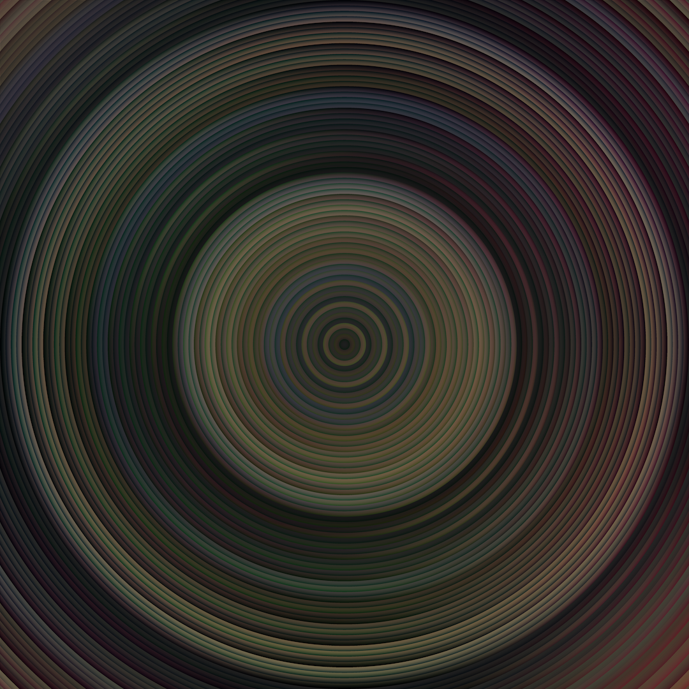

This is the result of a digital painting process using several different alpha masks overlayed on top of each other. Each mask layer is build from repeating gradients that radiate out from the centre.

<figure>
  
</figure>

Each mask layer has twice the number of concentric circles as the previous one.

I imported each layer into a digital painting app and painted using layers as separate alpha masks.

Source: [github.com/grough/sketchbook](https://github.com/grough/sketchbook/blob/main/sketch_230331b_RingGradientMaskLayers/sketch_230331b_RingGradientMaskLayers.pde)
