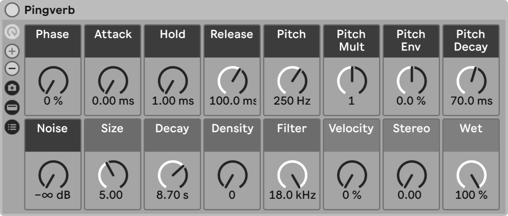

  <strong>Pingverb</strong> is an
  <strong>Ableton Instrument Rack</strong> for creating reverb tail
  sounds.

  Download the <a href="Pingverb 1.0.alp">Pingverb 1.0.alp</a> Ableton
  Live Pack.

  Installation requires Ableton Live 12 Suite due to a dependency on the
  Operator instrument.

